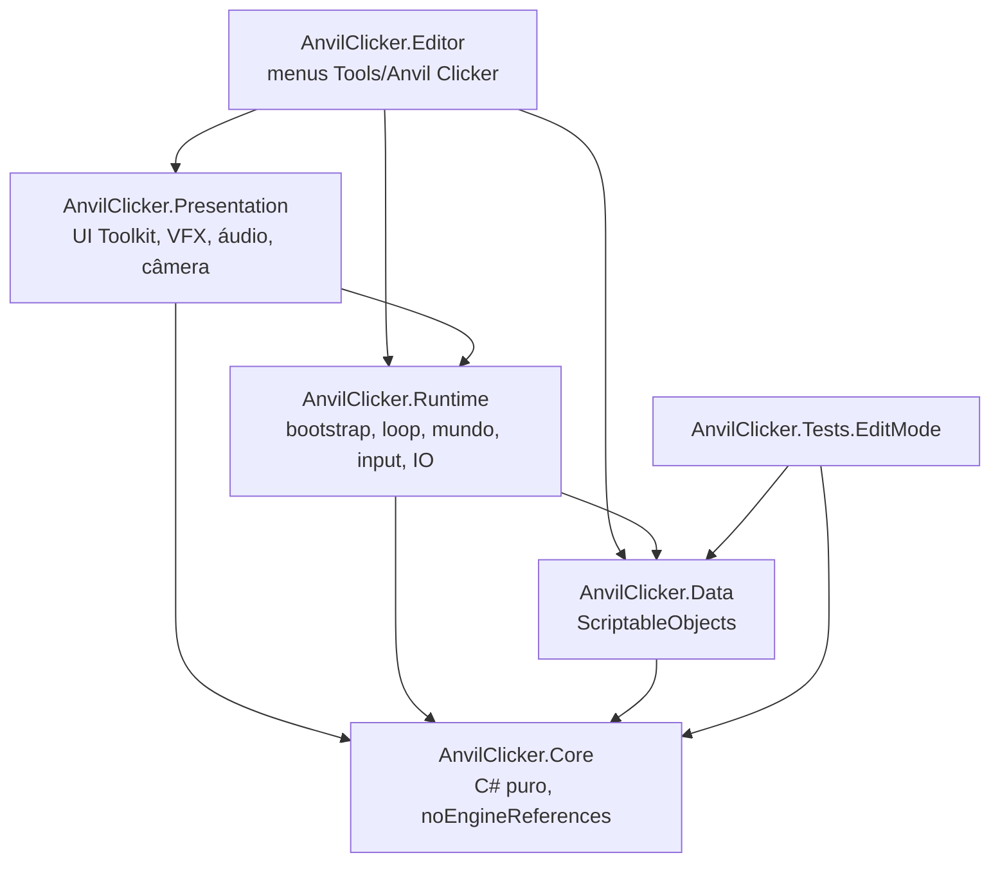
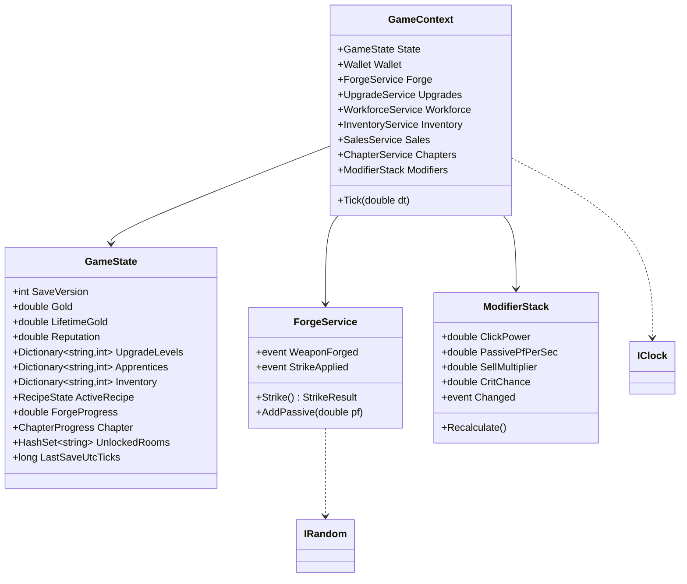

# Anvil Clicker — Arquitetura

> **Status:** v1, aprovada em 2026-10-03.

## 1. Decisões técnicas

| Tema | Decisão | Por quê |
|---|---|---|
| Engine | Unity **6000.3.25f1** (Unity 6.3 LTS), fixada em `ProjectSettings/ProjectVersion.txt` | Requisito |
| Render | **URP com 2D Renderer** | 2D Lights (brilho da forja, faíscas) e sorting 2D nativo |
| Mundo | **Tilemap isométrico** (Cell Layout = Isometric) | Escolha da Fase 0 |
| Input | New Input System (`.inputactions` gerado com classe C#) | Requisito. Mapeia teclado e mouse e deixa gamepad pronto para depois |
| UI | **UI Toolkit** (UXML/USS) | São arquivos de texto, então consigo escrever a UI sem operar o Editor. Lida bem com HUD, painéis e modais |
| Números | `double` + `NumberFormatter` | Ver §7 |
| Save | JSON via **Newtonsoft Json** (pacote oficial `com.unity.nuget.newtonsoft-json`) | O `JsonUtility` não serializa `Dictionary` e não permite migração por `JObject`. Aprovado; entra no M2 |
| Câmera | Script próprio de follow (SmoothDamp + limites + zoom) | Evita dependência. Cinemachine (oficial) é opcional se quisermos mais depois |
| Testes | Unity Test Framework, EditMode | Requisito |

**Pacotes previstos** (todos oficiais da Unity, nenhum de terceiros):
- `com.unity.render-pipelines.universal`
- `com.unity.inputsystem`
- `com.unity.2d.tilemap`
- `com.unity.2d.tilemap.extras`
- `com.unity.2d.sprite`
- `com.unity.test-framework`
- `com.unity.nuget.newtonsoft-json` (a partir do M2)

## 2. Camadas e assemblies



| Assembly | Conteúdo | Referencia UnityEngine? |
|---|---|---|
| **Core** | Estado do jogo, serviços, fórmulas, modificadores, offline, save (serialização), pathfinding, formatação | **Não** (`noEngineReferences: true`) |
| **Data** | ScriptableObjects que implementam as interfaces de definição do Core | Sim |
| **Runtime** | Composition root, game loop, I/O do save, mundo isométrico (player, estações, interação), input | Sim |
| **Presentation** | Views/presenters de UI, VFX, áudio, câmera e shake | Sim |
| **Editor** | Geradores de cena, prefabs, dados, sprites placeholder, validadores | Sim (Editor only) |
| **Tests.EditMode** | Testes do Core e validação dos dados | Sim |

**Regra de ouro:**
- O Core não conhece Unity, UI nem VFX.
- A apresentação só **lê** o estado e **reage a eventos**.
- Toda mudança de estado passa por um serviço do Core.

## 3. Core: modelo e serviços



**Serviços:**

| Serviço | Responsabilidade | Eventos |
|---|---|---|
| `Wallet` | Ouro: `Add`, `TrySpend`, `CanAfford` | `GoldChanged` |
| `ForgeService` | Receita ativa, progresso de PF, golpe/crítico, conclusão de arma | `StrikeApplied(StrikeResult)`, `WeaponForged(WeaponId)`, `ProgressChanged` |
| `UpgradeService` | Níveis, custo (×1/×10/×100/Máx), compra | `UpgradePurchased` |
| `WorkforceService` | Aprendizes, PF/s, marcos | `WorkforceChanged` |
| `ModifierStack` | Agrega multiplicadores (upgrades, aprendizes, runas, legado) e recalcula só quando algo muda | `Changed` |
| `InventoryService` | Prateleira, reservas para o reino | `InventoryChanged` |
| `SalesService` | Venda manual/automática | `WeaponsSold` |
| `ChapterService` | Metas, entregas, recompensas, desbloqueios | `GoalProgressed`, `ChapterCompleted` |
| `RoomService` | Salas compradas/desbloqueadas | `RoomUnlocked` |

**Funções puras (estáticas, 100% testáveis):**
- `EconomyFormulas`: custo geométrico, custo em lote, quantidade máxima comprável e valor de venda.
- `OfflineProgressCalculator`: `(estado, definições, Δt) → OfflineReport`.
- `NumberFormatter`: sufixos e notação científica.
- `IsoGridPathfinder`: A* no grid de células caminháveis.

**Abstrações para teste:**
- `IClock`: `UtcNow`.
- `IRandom`: `NextDouble()`, para testar crítico com seed fixa.

### Eventos

- Usamos **C# events nos serviços** (`event Action<T>`), sem barramento estático global.
- Os presenters se inscrevem em `OnEnable` e se desinscrevem em `OnDisable`.
- O acoplamento fica explícito (você vê quem depende de quem) sem singletons.

## 4. Composition root (sem singletons)

```text
Cena Workshop
└── GameBootstrap (MonoBehaviour)          ← único ponto de montagem
    ├── carrega GameDatabase (SO)
    ├── SaveSystem.Load() → GameState (ou novo) → migrações
    ├── OfflineProgressCalculator → OfflineReport
    ├── new GameContext(state, database, clock, random)
    ├── injeta o contexto em todo IContextConsumer da cena (Bind(GameContext))
    └── GameLoop (MonoBehaviour) → context.Tick(Time.deltaTime) + autosave
```

O contexto não é acessível estaticamente. Quem precisa dele recebe via `Bind` ou por referência serializada.

## 5. Mundo isométrico 2D

**Grid e tilemaps:**
- `Grid` com Cell Layout **Isometric** e Cell Size `(1, 0.5, 1)`.
- **Floor** (Chunk mode, sorting layer `Floor`).
- **Walls** (Individual mode, sorting layer `World`, com `TilemapCollider2D` + `CompositeCollider2D`).

**Ordenação de profundidade:**
- O URP 2D Renderer usa **Transparency Sort Mode = Custom Axis `(0, 1, 0)`**: quem está mais abaixo na tela é desenhado na frente.
- Sprites do mundo usam o pivô na base (pés).
- Objetos grandes usam `SortingGroup`.

**Elementos do mundo:**
- **Estações** são GameObjects (prefabs), não tiles. Cada uma tem:
  - um `StationDefinition` (SO);
  - um `Interactable` (raio de interação e ponto de parada);
  - um painel de UI associado.
- **Salas** (`RoomDefinition`) guardam uma lista de células de tile e prefabs de estação. Ao desbloquear, o `RoomBuilder` pinta os tiles e instancia as estações com animação.

**Movimento e câmera:**
- **Player:** `Rigidbody2D` (kinematic + `MovePosition`) e WASD relativo à tela. A animação usa 4 direções isométricas, escolhidas pelo quadrante da velocidade.
- **Click numa estação:** `IsoGridPathfinder` (Core) gera o caminho em células e o player segue os waypoints.
- **Câmera:** `CameraFollow` com SmoothDamp, limites do mapa, zoom em degraus e shake via offset aditivo (respeita a opção de acessibilidade).

## 6. Dados (ScriptableObjects)

| SO | Campos principais |
|---|---|
| `GameDatabase` | Listas de todas as definições e lookup por id |
| `GameBalanceConfig` | Crítico, offline (teto/eficiência), autosave, marcos |
| `WeaponTypeDefinition` | id, nome, ícone, PF base, valor base |
| `MaterialDefinition` | id, tier, mult. valor, mult. PF, custo por arma, desbloqueio |
| `UpgradeDefinition` | id, categoria, custo base, crescimento, nível máx., efeitos (`ModifierType` + valor + operação), requisitos |
| `ApprenticeDefinition` | id, PF/s base, custo base, crescimento, sprite |
| `RoomDefinition` / `StationDefinition` | Custo, requisitos, prefab, células |
| `ChapterDefinition` | Carta (texto e retrato), metas (tipo, material, tag de runa, qtd), recompensas |
| `RuneDefinition` *(M6)* | id, tag, multiplicador, custo, combinações |
| `AchievementDefinition` *(M7)* | Condição, recompensa |

- Todo SO tem um **`id` string estável**, que é o que vai para o save. Nunca renomear: só depreciar.
- O validador do Editor checa ids únicos, referências nulas e curvas de custo absurdas.
- O Core enxerga interfaces (`IUpgradeDefinition`...). Os SOs as implementam.

## 7. Números grandes

**Decisão:** usar `double`.

- O alcance vai até ~1,8e308, suficiente para um incremental com prestígio, já que a progressão é desenhada para ficar abaixo de ~1e300.
- É rápido, serializa direto em JSON e funciona com `Math.Pow` e `Math.Log` (essenciais para o "Máx" de compra).
- A precisão de 15–16 dígitos é irrelevante na exibição.

**Formatação:** `NumberFormatter.Format(double, NumberFormat.Short | Scientific)`.
- Sufixos K, M, B, T, Qa, Qi, Sx, Sp, Oc, No, Dc; depois `aa`, `ab`...
- Usa a cultura pt-BR (vírgula decimal).

Se um dia precisarmos passar de 1e308, trocamos por uma struct `BigNumber` (mantissa + expoente) atrás do mesmo formatter. Os testes de fórmula protegem essa migração.

## 8. Save / Load

**Formato:**

```json
{
  "saveVersion": 1,
  "gameVersion": "0.1.0",
  "savedAtUtc": "2026-10-02T19:00:00Z",
  "state": { "...": "GameState" }
}
```

**Migrações e escrita:**
- **Migrações:** `ISaveMigration { int From; JObject Migrate(JObject) }`, aplicadas em cadeia até a versão atual. Cada migração tem um teste.
- **Escrita atômica:** grava `save.tmp`, move o atual para `save.bak` e renomeia o tmp. Se o load falhar, tenta o `.bak`.
- **Local:** `Application.persistentDataPath/save.json`. No WebGL, isso é IndexedDB; vamos validar a persistência no build WebGL do M2.

**Gatilhos:**
- Autosave a cada 30 s (configurável).
- Ao comprar algo importante.
- Em `OnApplicationPause`, `OnApplicationFocus(false)` e `OnApplicationQuit`. No WebGL o quit não é confiável, por isso o autosave periódico.

## 9. Apresentação

**UI Toolkit:**
- `HUD.uxml`: ouro, PF/s, reputação, receita ativa e barra de progresso.
- Um painel por estação.
- Modal de resumo offline.
- `FloatingTextLayer`, que posiciona labels via `RuntimePanelUtils.CameraTransformWorldToPanel`.

**Padrão:**
- Cada tela tem um **Presenter** (C#) que se liga ao `GameContext`, assina eventos e atualiza a View (UXML).
- Clicks de UI chamam métodos de serviço; nada de lógica de economia na UI.

**Feedback e áudio:**
- **Feedback (juice):** `StrikeFeedback` escuta `ForgeService.StrikeApplied` e dispara partículas, som, número flutuante, squash e shake. Nada disso afeta a lógica.
- **Áudio:** `AudioPlayer` com pool de `AudioSource`, variação de pitch e categorias (SFX/Música) com volume salvo.

## 10. Estrutura de pastas

```text
Assets/_Project/
├── Scripts/
│   ├── Core/            AnvilClicker.Core.asmdef
│   ├── Data/            AnvilClicker.Data.asmdef
│   ├── Runtime/         AnvilClicker.Runtime.asmdef
│   ├── Presentation/    AnvilClicker.Presentation.asmdef
│   └── Editor/          AnvilClicker.Editor.asmdef
├── Tests/
│   └── EditMode/        AnvilClicker.Tests.EditMode.asmdef
├── ScriptableObjects/   (Database, Balance, Weapons, Materials, Upgrades, Apprentices, Rooms, Chapters)
├── Prefabs/             (Player, Stations, VFX)
├── Scenes/              (Workshop; uma cena só no MVP)
├── Art/                 (Sprites, Tiles, Placeholders)
├── Audio/
├── UI/                  (UXML, USS, PanelSettings, Themes)
└── Settings/            (URP assets, Input Actions)
```

Os testes ficam em `Assets/_Project/Tests`, separados do código de jogo. O asmdef de teste já fica fora dos builds via `UNITY_INCLUDE_TESTS`.

## 11. Ferramentas de Editor (`Tools/Anvil Clicker/...`)

| Menu | O que faz |
|---|---|
| `Setup/Create Folders` | Cria a estrutura de pastas acima |
| `Setup/Configure Project` | Sorting layers, Transparency Sort Axis, URP 2D asset, Force Text, Input Actions |
| `Art/Generate Placeholder Sprites` | Gera PNGs (losangos, ícones, ferreiro) via `Texture2D.EncodeToPNG` + Tile assets |
| `Data/Generate Sample Data` | Cria todos os SOs com os valores do GDD |
| `Data/Validate Database` | Checa ids, referências e curvas |
| `Scenes/Build Workshop Scene` | Monta grid, tilemaps, estações, player, câmera, UI e bootstrap |
| `Save/Open Save Folder`, `Save/Delete Save` | Utilidades de debug |
| `Debug/Add Gold…` | Cheats só no Editor/Development build |

Os geradores são **idempotentes**: rodar de novo atualiza em vez de duplicar.

## 12. Testes (EditMode)

- `EconomyFormulasTests`: custo n-ésimo, lote, máx comprável, casos de borda (0, ouro insuficiente, valores enormes).
- `NumberFormatterTests`: limites de sufixo (999 → 1K), científico, negativos, NaN/∞.
- `ForgeServiceTests`: crítico com `IRandom` fixo, conclusão de arma, sobra de PF passando para a próxima arma.
- `OfflineProgressTests`: teto, eficiência, relógio voltando, custo de material, venda automática.
- `SaveMigrationTests`: v1→vN, save corrompido → `.bak`.
- `PathfinderTests`: caminho simples, bloqueio, sem caminho.
- `DatabaseValidationTests`: ids únicos nos SOs reais.

A meta é cobrir 100% das funções puras do Core.
