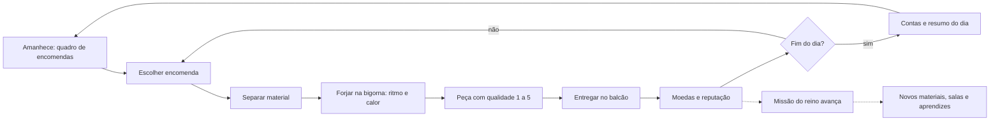

# Anvil Clicker — Game Design Document

> **Status:** v2, **aprovada em 2026-10-06**. Substitui a v1 (aprovada em 2026-10-03), que era um incremental clássico.
> **Por que mudou:** o foco agora é **missões, encomendas e uma economia pequena**, e não números enormes de dinheiro e armas.
> Todos os números são **valores iniciais de balanceamento** e vão morar em ScriptableObjects. A direção visual está em [`ART_DIRECTION.md`](ART_DIRECTION.md).

## 1. Resumo

| | |
|---|---|
| **Gênero** | Gestão artesanal com missões (sim de oficina), com exploração leve |
| **Pitch** | *Você herdou uma ferraria pequena, de portas abertas para a avenida mais movimentada da vila, num reino em crise. Atenda os clientes que passam, cumpra as missões do reino e faça a oficina prosperar.* |
| **Plataforma** | PC (Windows) principal, com build WebGL para playtest. Mouse + teclado |
| **Visual** | 2D isométrico (Tilemap + sprites), pixel art. Uma pequena loja medieval aconchegante |
| **Monetização** | Nenhuma |
| **Sessão típica** | 10–30 min, com 2–6 "dias" de jogo |

## 2. Pilares

1. **Cada peça importa.** Poucas armas, cada uma feita com atenção. Qualidade e escolha pesam mais que quantidade.
2. **Pessoas e pedidos.** Clientes com nome, gostos e prazos dão motivo para forjar. Cumprir bem rende reputação.
3. **Economia pequena e legível.** Preços de dezenas e centenas de moedas. Dá para entender cada número na tela.
4. **A loja prospera.** Missões cumpridas melhoram a oficina, que fica visivelmente mais bonita e movimentada.
5. **Respeito ao tempo.** Nada de punição pesada por ficar fora. Dá para parar a qualquer hora.

## 3. O loop

| Escala | Ação | Duração |
|---|---|---|
| Micro | Uma martelada no ritmo certo | segundos |
| Meso | Forjar e entregar uma peça | 30–90 s |
| Dia | 3–5 encomendas, contas no fim | 3–4 min |
| Missão | Meta do reino com prazo em dias | 2–6 dias |
| Capítulo | Uma crise inteira, com história | 30–60 min |

## 4. A forja e a qualidade

- Cada peça tem um número de **golpes** (6 a 16, conforme o tipo).
- No **modo forja** (como já funciona: `E` na bigorna, câmera aproxima) aparece um **anel de ritmo** sobre a peça. Clicar (ou Espaço) quando o anel fecha dá **Perfeito**, **Bom** ou **Falho**.
- O **calor** da peça cai com o tempo. Os **foles** (tecla `Q`) reacendem; golpear a peça fria vale menos. A forja melhor segura o calor por mais tempo.
- **Qualidade final (★1 a ★5):** média ponderada dos golpes, mais bônus de material e de melhorias.
- **Acessibilidade:** opção "forja tranquila" sem timing (qualidade fixa ★3, tempo maior) e opção de reduzir o screen shake.
- O juice atual (faíscas, números, squash, shake no crítico) é mantido. O **crítico** vira o golpe **Perfeito**.

| Qualidade | Preço | Como se mostra |
|---|---|---|
| ★1 Tosca | ×0,6 | marca de martelada irregular |
| ★2 Comum | ×0,85 | |
| ★3 Boa | ×1,0 | brilho discreto |
| ★4 Ótima | ×1,25 | brilho forte |
| ★5 Obra-prima | ×1,6 | brilho dourado e nome gravado |

## 5. Peças e materiais

| Peça | Golpes | Preço base | Material por peça |
|---|---|---|---|
| Adaga | 6 | 14 | 1 |
| Lança | 8 | 30 | 2 |
| Espada curta | 8 | 32 | 2 |
| Machado de guerra | 9 | 38 | 3 |
| Escudo | 10 | 36 | 3 |
| Maça | 9 | 40 | 3 |
| Espada longa | 12 | 70 | 4 |
| Alabarda | 14 | 90 | 5 |

| Material | Custo por unidade | Multiplicador de preço | Liberado em |
|---|---|---|---|
| Ferro | 2 | ×1 | início |
| Aço | 7 | ×2,2 | Capítulo 1 |
| Mithril | 24 | ×5 | Capítulo 3 |

Estoque de material é **limitado e comprado** no Depósito (preço varia um pouco por dia). Não existe "material infinito".

## 6. Clientes e encomendas

- **Os clientes chegam pela avenida** (ver §6.1) e vão até o balcão. Cada encomenda tem: **cliente**, **peça**, **material mínimo**, **qualidade mínima**, **prazo** (em dias), **preço** e, às vezes, **gorjeta** por entregar antes.
- Clientes têm perfil: **Guarda da vila** (peças simples, boa paga, exige qualidade ★3), **Caçador** (lanças, machados), **Aldeã** (utensílios e reparos, paga pouco, dá muita reputação), **Mercador** (lotes e revenda), **Cavaleiro** (espadas longas, ★4+).
- **Recusar** é permitido, com pequena perda de reputação com aquele cliente. **Falhar o prazo** perde mais.
- A reputação por **facção** (Guarda, Aldeões, Reino) libera clientes e encomendas melhores.

### 6.1 A avenida (a loja é um comércio de verdade)

A fachada da loja é **aberta para uma avenida movimentada**, onde pessoas passam para lá e para cá o dia todo. A loja está **no meio do comércio**, não isolada.

- **Vida na rua:** aldeões, crianças, guardas, mercadores, monges e cães andam pela avenida em rotas de ida e volta, com pausas para olhar a vitrine. A densidade varia com a hora do dia (mais gente de manhã e à tarde, pouca à noite, com lampiões acesos).
- **Clientes na fila:** quem tem uma encomenda **sai do fluxo da rua, entra na fila do balcão** e aparece com um indicador acima da cabeça (a peça pedida e a cor do prazo). A encomenda só vai para o quadro depois que o cliente chega.
- **A vitrine importa:** peças expostas e boas entregas atraem mais clientes e melhores. Com o tempo a fachada melhora (placa nova, toldo, vasos) e a rua fica mais movimentada.
- **Escopo:** o ferreiro **não sai** para a rua (por enquanto); ele atende pelo balcão voltado para a avenida. A rua é vista, ouvida e habitada. Passear por ela pode virar uma expansão futura.

## 7. Missões do reino (campanha)

Cartas do rei/capitão trazem metas **pequenas e específicas** com prazo. Concluir um capítulo conta uma parte da história e libera conteúdo.

| # | Crise | Meta (exemplo) | Recompensas |
|---|---|---|---|
| 1 | **Bandidos na Estrada do Rei** | 6 adagas ★2+ e 4 espadas curtas ★3+ em 6 dias | Aço, Depósito, 1º aprendiz |
| 2 | **O Cerco Orc** | 8 lanças de aço ★3+ e 6 escudos ★3+ em 8 dias | Sala dos aprendizes, 2º aprendiz, melhorias |
| 3 | **A Praga dos Mortos-Vivos** | 6 maças de aço ★4+ e lote de 10 peças simples para a vila | Mithril, reputação máxima com Aldeões |
| 4 | **O Despertar do Dragão** | 4 espadas longas de mithril ★4+ e 1 obra-prima ★5 | Final da campanha, 3º aprendiz |

- Sem derrota: se o prazo estoura, o rei dá mais tempo com **custo de reputação** (e a história reage).
- Entre capítulos há **missões secundárias**: pedidos de clientes recorrentes, reparos para a vila e eventos (mercador viajante, encomenda urgente).

## 8. A oficina

**Salas** (cada uma aparece fisicamente no mapa):
- **Oficina** (início): bigorna, forja, mesa de melhorias, balcão, quadro de encomendas.
- **Depósito** (Cap. 1): estoque e compra de material.
- **Quarto dos aprendizes** (Cap. 2): moradia dos 2º e 3º aprendizes.
- **Sala de runas** (pós-MVP): encantamentos.

**Aprendizes** (no máximo 3, com nome e talento; cada um tem **salário diário**):
| Nome | Talento | Efeito |
|---|---|---|
| Tomás | Martelador | Ajuda a forjar peças simples (faz o trabalho de ½ peça por dia, ★2) |
| Inês | Acabamento | +1 nível de qualidade em até 2 peças por dia |
| Bento | Fornalheiro | A peça esfria mais devagar; mantém a forja acesa |

**Melhorias** (~12, de **nível e custo fixos**, uma compra cada ou 2–3 níveis): Martelo de ferro → aço → mestre, Foles, Carvão de pedra, Bigorna de mestre, Tonel de têmpera, Esmeril, Prateleira de armas, Janela e lanternas (luz), Ferramentas na parede, Placa da loja. Custam **30 a 600 coroas**, sem crescimento exponencial.

## 9. Economia (números-alvo)

- **Moeda:** coroas. No início, 40 coroas.
- **Renda do dia:** ~80 no começo, ~250 no fim do Cap. 1, ~600 no Cap. 3, ~1.500 no fim do jogo.
- **Contas diárias:** aluguel 10 + salários (0 / 12 / 25 / 40 conforme aprendizes) + manutenção da forja.
- **Teto realista:** dezenas de milhares de coroas ao fim da campanha. `NumberFormatter` continua existindo (separador de milhar), mas `K/M/B` quase não aparece.
- **Anti-inflação:** preços de material sobem de leve com o estoque comprado no dia; encomendas ficam mais exigentes (qualidade), não mais numerosas.

## 10. Eventos e conquistas (leves)

- **Mercador viajante:** passa um dia na vila vendendo material raro ou comprando peças.
- **Encomenda urgente:** prazo curto, gorjeta alta.
- **Festival da vila:** muita procura por peças decorativas.
- **Conquistas:** marcos pequenos (primeira ★5, 20 clientes atendidos, todas as melhorias) com um bônus simbólico (um enfeite na loja).

## 11. Tempo e progresso offline

- O **dia só passa com o jogo aberto.** Fechar o jogo **não** estoura prazos.
- Ao voltar, os **aprendizes terminam peças que já estavam em fila** (limite: o que cabe em 1 dia de trabalho de cada um) e um resumo mostra o que ficou pronto. Nada de ganhos gigantes.
- O save continua versionado, com autosave, escrita atômica e backup.

## 12. Controles

- **WASD/setas** andam; **E** usa a estação; **Esc** fecha painéis/sai do modo forja; **scroll** muda o zoom; **click** numa estação faz o ferreiro andar até ela.
- Modo forja: **click/Espaço** golpeia no ritmo; **Q** acende os foles.

## 13. Linguagem e números

- Textos externalizados desde o início, pt-BR primeiro e inglês depois.
- `NumberFormatter` mantido (pt-BR), com notação científica opcional nas configurações.

## 14. Escopo do MVP (`v0.1.0`)

**Inclui:** identidade visual (loja medieval aberta para a avenida, com pedestres, + ferreiro), dia, quadro de encomendas, forja com qualidade, estoque e balcão, o **Capítulo 1** completo com cartas e recompensas, 1 aprendiz, 6 melhorias, save e WebGL.
**Fora:** capítulos 2–4, runas, eventos, conquistas, mithril, legado.

## 15. Legado (pós-MVP, a redesenhar)

A ideia anterior (marcas que multiplicam produção) **sai**. Se houver um sistema de legado, será pequeno e narrativo (por exemplo, passar a loja para o próximo da família, com 1–2 bônus simbólicos).

## 16. Registro de decisões

| Tema | Decisão | Data |
|---|---|---|
| Visual | Tilemap 2D isométrico + sprites | 2026-10-03 |
| Plataforma | PC (Windows) + WebGL | 2026-10-03 |
| Monetização | Nenhuma | 2026-10-03 |
| Idioma | pt-BR primeiro, textos externalizados | 2026-10-03 |
| Golpes | Só no modo forja, perto da bigorna | 2026-10-04 |
| Loja de melhorias | Abre numa estação (Mesa de Melhorias) | 2026-10-04 |
| Arte | Pixel art por código, com agente de direção de arte | 2026-10-06 |
| **Foco do jogo** | **Missões, encomendas e economia pequena (design v2)** | **2026-10-06** |
| **Fachada** | **Loja aberta para uma avenida movimentada; clientes chegam pela rua** | **2026-10-06** |
| Ferreiro | Fixo: Mestre Baldo (48 px, barbudo, lenço vermelho-ferrugem) | 2026-10-06 |
| Câmera | Zoom inteiro (2× normal, 3× no modo forja) | 2026-10-06 |
| Fonte da UI | Fonte pixel OFL (com aprovação no momento do download) | 2026-10-06 |
| Prosperidade | 3 estágios ligados a capítulos e melhorias; luz da janela segue o dia/noite | 2026-10-06 |

## 17. Questões em aberto

1. O ritmo da forja deve ser **timing de um anel** (proposto) ou algo mais passivo (ex.: manter o calor num intervalo)?
2. Quantos **dias** deve durar um capítulo (proposto: 6 a 10)?
3. Falhar um prazo deve ter **consequência narrativa** forte (proposto) ou só custo de reputação?
4. Os aprendizes devem poder **sair** se o salário atrasar?
