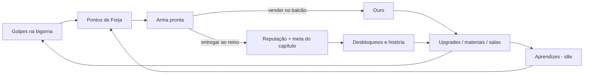

# Anvil Clicker — Game Design Document

> **Status:** v1, aprovada em 2026-10-03.
> Decisões tomadas estão marcadas com ✅. Todos os números são **valores iniciais de balanceamento** e vão morar em ScriptableObjects.

## 1. Resumo

| | |
|---|---|
| **Gênero** | Incremental / clicker com exploração leve |
| **Plataforma** | PC (Windows) principal, com build WebGL para playtest. Mouse + teclado |
| **Visual** | 2D isométrico (Tilemap + sprites). Placeholders até termos arte |
| **Monetização** | Nenhuma (premium ou gratuito). Sem anúncios e sem IAP |
| **Sessão típica** | 5–30 min ativos, com retorno idle/offline |
| **Pitch** | *O reino está em chamas, e cada espada que sai da sua bigorna é mais um soldado na muralha.* |

## 2. Pilares

1. **Cada golpe tem peso.** O click é o coração do jogo, com feedback forte (faíscas, som, números, shake e crítico).
2. **A ferraria cresce de verdade.** O progresso é visível no espaço: salas, estações e aprendizes aparecem no mapa.
3. **Otimizar com propósito.** As crises do reino dão motivo narrativo para ficar mais forte.
4. **Respeito ao tempo do jogador.** Há progresso idle e offline, sem derrota e sem punição por ficar fora.

## 3. Loops de jogo

| Escala | Ação | Duração |
|---|---|---|
| Micro | Golpear, ver a arma ficar pronta | segundos |
| Meso | Comprar upgrades, trocar a receita, vender e entregar | minutos |
| Macro | Concluir capítulos, expandir a loja, novos materiais | horas |
| Meta | Legado (prestígio) | dias |

## 4. Recursos

| Recurso | Como ganha | Para que serve |
|---|---|---|
| **Pontos de Forja (PF)** | Clicks e aprendizes | Progresso da arma atual. Não é moeda |
| **Ouro** | Venda de armas | Upgrades, materiais, salas, contratações |
| **Armas** | Forja | Vender (ouro) ou entregar ao reino (reputação) |
| **Materiais** | Comprados com ouro (comuns) ou recompensas (raros) | Definem o tier e o valor da arma |
| **Reputação** | Entregas ao reino, capítulos | Desbloqueios (nível de favor). Não é gasta |
| **Essência Arcana** (pós-MVP) | Capítulos, eventos, desencantar | Runas e itens mágicos |
| **Marcas do Legado** (fim de jogo) | Prestígio | Bônus permanentes |

## 5. A bigorna (click)

- A forja tem uma **receita ativa** (tipo de arma + material) que se repete automaticamente.
- Cada arma exige uma quantidade de PF (ex.: Adaga de Ferro = 10 PF).
- **Golpe** = poder do martelo × multiplicadores.
- **Crítico:** 5% de chance, dano ×5 (ambos melhoráveis).
- **Feedback (juice):**
  - faíscas (partículas), som de martelo com variação de pitch e número flutuante (maior e dourado no crítico);
  - squash & stretch na bigorna, screen shake leve (só no crítico) e barra de progresso;
  - quando a arma fica pronta, ela "salta" para a prateleira.
- **Acessibilidade:** opção para reduzir ou desligar o shake, e a tecla **Espaço** como alternativa ao click.
- ✅ Sem limite de clicks/s (é single-player).

## 6. Produção passiva — aprendizes

| Ajudante | PF/s base | Custo base | Crescimento |
|---|---|---|---|
| Aprendiz | 1 | 15 | 1,15 |
| Ferreiro jornaleiro | 8 | 100 | 1,15 |
| Ferreiro veterano | 47 | 1.100 | 1,15 |
| Mestre ferreiro | 260 | 12.000 | 1,15 |
| Armeiro real *(capítulo 2+)* | 1.400 | 130.000 | 1,15 |

- **Marcos:** com 25, 50, 100 e 200 unidades de um tipo, a produção desse tipo dobra.
- **Treinamentos** (upgrades únicos) multiplicam a produção de um tipo.
- **Visual:** cada tipo contratado aparece como um sprite trabalhando numa bancada, com um contador em vez de N sprites.

## 7. Upgrades

| Categoria | Efeito | Exemplo |
|---|---|---|
| **Martelos** | +poder do click | Madeira → Ferro → Aço → Mithril → Rúnico |
| **Forja (calor)** | Multiplicador global de PF (click + idle) | Foles, carvão de pedra, forja de lava |
| **Aprendizes** | Contratar unidades / treinamentos | Ver §6 |
| **Precisão** | Chance e dano de crítico | Olho do mestre |
| **Comércio** | +valor de venda, venda automática | Vendedor de balcão, contrato com a guilda |
| **Expansão** | Novas salas e estações | Depósito, alojamento, sala de runas |

- **Custo:** `custo(n) = base × r^n`, com `r` entre 1,07 e 1,15 conforme a categoria.
- **Compra em lote:** ×1 / ×10 / ×100 / Máx. Usa a soma geométrica, sem loop.

## 8. Materiais e catálogo de armas

**Materiais (tiers):**

| Tier | Material | Mult. valor | Mult. PF | Desbloqueio |
|---|---|---|---|---|
| 1 | Ferro | ×1 | ×1 | Início |
| 2 | Aço | ×6 | ×4 | Capítulo 1 |
| 3 | Mithril | ×40 | ×20 | Capítulo 2 |
| 4 | Orichalcum (arcano) | ×300 | ×110 | Capítulo 3 |
| 5 | Aço-estelar (arcano) | ×2.500 | ×700 | Capítulo 4 |

A relação valor/PF cresce a cada tier, então vale a pena subir de material.

**Tipos de arma:** Adaga, Espada curta, Lança, Machado de guerra, Escudo, Maça, Espada longa e Alabarda. Cada um tem PF base e valor base próprios. Alguns capítulos exigem tipos específicos.

**Arma** = Tipo × Material, calculada (sem um asset para cada combinação).

**Custo do material** ✅: debitado do ouro automaticamente quando cada arma começa. Se faltar ouro, a forja pausa. Materiais arcanos (tier 4+) têm estoque próprio e vêm de recompensas e eventos.

## 9. Balcão de vendas

- Armas prontas vão para a prateleira (estoque).
- No início a venda é manual no balcão, o que dá motivo para andar pela loja. O upgrade **Vendedor** (barato, ~5 min de jogo) automatiza a venda.
- Cada tipo de arma pode ser marcado como **"reservar para o reino"** para não ser vendido.

## 10. A loja isométrica (exploração)

**Salas:**
- Oficina principal: bigorna, forja, balcão, mesa do mensageiro.
- Depósito.
- Alojamento dos aprendizes.
- Sala de runas *(pós-MVP)*.
- Câmara arcana *(pós-MVP)*.
- Salão do Legado *(fim de jogo)*.

**Controles (proposta):**
- **WASD** relativo à tela, em 8 direções, com animação nas 4 direções isométricas.
- **E** ou **click numa estação**: o ferreiro anda até ela (A* no grid) e abre o painel.
- **Esc** fecha painéis.
- **Modo forja:** ao interagir com a bigorna, a câmera aproxima. A partir daí, clicks na bigorna (ou Espaço) são golpes. Andar com WASD sai do modo.

Escolhi WASD em vez de click-to-move puro porque o click do mouse já é o golpe na bigorna. Os dois juntos causariam conflito.

**Câmera e expansão:**
- A câmera segue o ferreiro com suavização, respeita os limites do mapa e tem 2–3 níveis de zoom (scroll).
- Ao comprar uma sala, os tiles e as estações aparecem com animação (poeira e construção).
- O upgrade **Sino do Capataz** permite abrir painéis à distância. Ele reduz o atrito depois que o jogador já conhece a loja.

## 11. Crises do reino (capítulos)

| # | Crise | Metas (exemplo) | Recompensas |
|---|---|---|---|
| 1 | **Bandidos na Estrada do Rei** | 25 Adagas + 15 Espadas curtas de ferro | Aço, sala Depósito, +reputação |
| 2 | **O Cerco Orc** | 40 Lanças + 30 Escudos de aço | Mithril, Armeiro real, Alojamento |
| 3 | **A Praga dos Mortos-Vivos** | 50 Maças de mithril com runa Sagrada | Orichalcum, Câmara arcana |
| 4 | **O Despertar do Dragão** | Armas de mithril+ com runa de Gelo e 1 item mágico lendário | Aço-estelar, desbloqueia o **Legado** |

- Cada capítulo tem uma carta do rei (texto + retrato), 1–3 metas de entrega no **Mensageiro do Rei** e recompensas.
- **Sem derrota:** o tempo é ilimitado.
- ✅ Bônus pequeno por concluir rápido (ex.: +50% de reputação abaixo de X min).

## 12. Runas e magia *(pós-MVP)*

- **Bancada de runas:** gravar uma runa na receita ativa aplica um multiplicador de valor e uma tag de efeito (Fogo, Gelo, Sagrado, Raio, Sombra). Os capítulos pedem essas tags.
- O custo é Essência Arcana por arma, ou fixo por receita (a definir no M6).
- **Combinação:** duas runas formam uma composta (Fogo + Raio = Tempestade), com receitas descobertas por experimentação.
- **Itens mágicos raros:** receitas especiais, de alto PF e alto valor, exigidas por capítulos.

## 13. Eventos e recompensas

- **Faísca dourada:** aparece aleatoriamente na tela. Clicando nela, o jogador ganha um bônus temporário (×7 de PF por 30 s, por exemplo).
- **Mercador viajante:** fica 2 min no balcão vendendo material raro ou bônus temporários.
- **Encomenda urgente do rei:** entregar N armas em T minutos rende ouro e reputação extras.
- **Conquistas:** marcos como 100 armas ou 1M de ouro. ✅ Cada uma dá +1% de produção.

## 14. Progresso offline

- Ao voltar, o jogo calcula o tempo fora pelo relógio UTC.
- **Teto inicial de 8 h** (upgrades levam até 24 h) e **eficiência de 50%** (upgrades levam até 100%).
- **Cálculo:**
  1. PF/s passivo × tempo × eficiência;
  2. o resultado vira armas da receita ativa, respeitando o custo de material;
  3. as armas são vendidas se houver vendedor automático.
- **Tela de resumo:** tempo fora, armas forjadas e ouro ganho.
- Se o relógio do sistema voltou no tempo, o ganho é zero.

## 15. Legado (prestígio, fim de jogo)

- Fica disponível após o capítulo 4.
- **Reinicia:** ouro, upgrades, aprendizes, salas, capítulos e materiais.
- **Mantém:** Marcas do Legado, conquistas e runas descobertas.
- **Marcas:** `floor(sqrt(reputaçãoTotal / 1e6))`. Cada marca dá +2% de produção global.
- ✅ Árvore de talentos do Legado, gastando marcas, no M8.
- NG+ (capítulos repetidos com metas escaladas): a decidir no M8.

## 16. Números e formatação

- Abreviação curta: `1.234` → `12,3K` → `4,56M` → B, T, Qa, Qi, Sx, Sp, Oc, No, Dc; depois `aa`, `ab`, ...
- Notação científica opcional nas configurações (`1,23e45`).
- ✅ **Idioma do jogo:** textos externalizados desde o início, com pt-BR primeiro e inglês depois.

## 17. Arte e áudio

- **Placeholders:** um Editor script gera sprites simples (losangos para os tiles, formas coloridas para as estações e o ferreiro).
- **Luz:** URP 2D Lights para o brilho pulsante da forja e das faíscas, o que dá muito efeito com pouca arte.
- **Áudio:** placeholder ou silêncio até a sua aprovação. Nenhum asset (nem CC0) entra sem você aprovar.

## 18. Escopo do MVP (v0.1.0)

**Inclui:**
- click com juice e ouro;
- upgrades de martelo, forja, precisão e comércio;
- 3–4 tipos de aprendiz;
- loja isométrica com a oficina mais 1 expansão (Depósito);
- WASD + interação;
- ferro e aço, com 6 tipos de arma;
- balcão de vendas;
- **capítulo 1**;
- save JSON com autosave e progresso offline.

**Fora:** runas, magia, capítulos 2–4, eventos, conquistas, Legado e áudio/arte finais.

## 19. Registro de decisões (2026-10-03)

| Tema | Decisão |
|---|---|
| Visual | Tilemap 2D isométrico + sprites |
| Plataforma | PC (Windows) + build WebGL para playtest |
| Monetização | Nenhuma |
| MVP | M1–M4 + capítulo 1 (tag `v0.1.0` ao fim do M5) |
| Custo de material | Debitado do ouro automaticamente a cada arma (§8) |
| Capítulo rápido | Bônus pequeno de reputação |
| Conquistas | +1% de produção cada |
| Idioma | Textos externalizados; pt-BR primeiro, inglês depois |
| Legado | Árvore de talentos no M8; NG+ a decidir no M8 |

**Ainda em aberto:** custo das runas (M6) e NG+ (M8).
